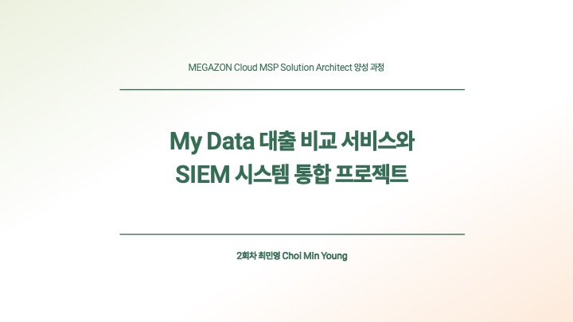
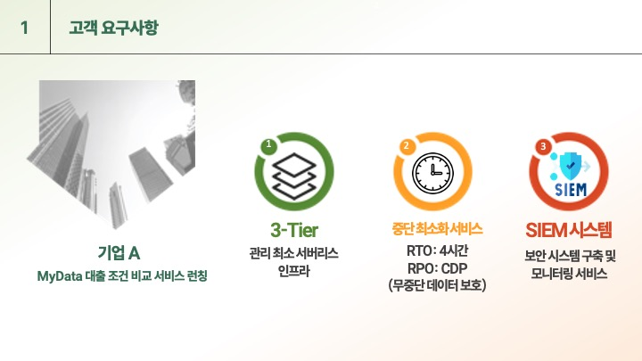
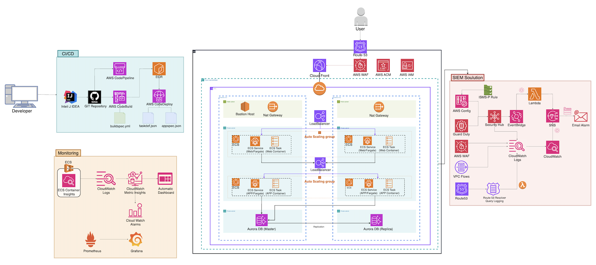
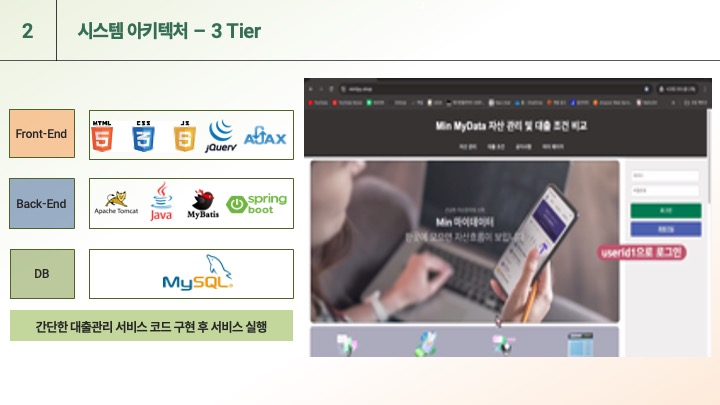
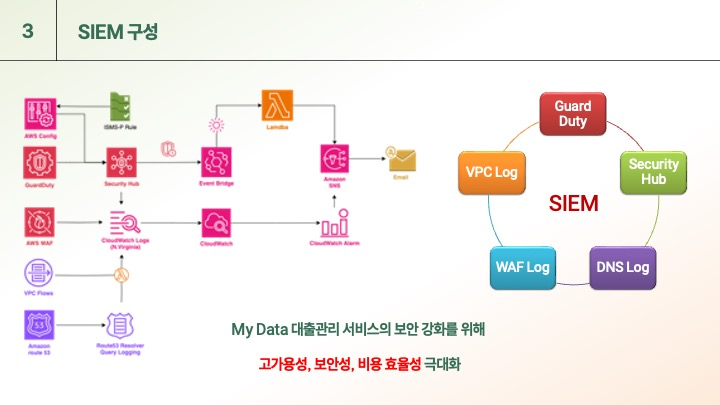
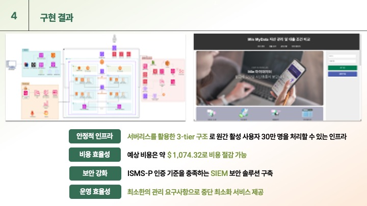

# 💻 My Data 대출 비교 서비스와 SIEM 시스템 통합 프로젝트

 

## ⌛️ 프로젝트 시나리오

대기업 A에서는 새로운 MyData 대출 조건 비교 서비스를 런칭하고자 합니다.
이 서비스는 매일 자정에 각 금융사의 최신 금융 정보를 업데이트할 계획입니다.
고객사는 관리가 최소화된 인프라 구축을 원하고 있으며, 서비스 보안에 매우 민감한 요구사항을 가지고 있습니다.
저희는 중단을 최소화하는 서비스를 위해 가용성을 확보하고, 보안 서비스 및 보안 장비를 활용하여 고객의 개인정보를 보호하고자 합니다.

보안 솔루션으로 SIEM(보안 정보 및 이벤트 관리) 시스템을 구축할 계획이며,
이를 통해 고객사의 보안팀이 자체적으로 보안 관리를 수행할 수 있도록 지원해야 합니다.

또한, 시스템 리소스에 대한 메트릭과 관련 로그를 취합한 보안 모니터링을 통해 서비스의 보안을 향상시키고자 합니다.

궁극적으로, ISMS-P 인증 기준에 최대한 부합하도록 보안 인증을 강화하고 안정적인 인프라를 운영할 계획입니다.

 
 

## 🔥 구현 요구사항

1. 서버리스를 활용한 3-tier 구조
2. ISMS-P 인증을 할 수 있는 native security service 구성
3. 위 1의 조건과 통합할 수 있는 SIEM 구성
4. 중단을 최소화하는 서비스 구축

## 🔥 운영 요구사항

1. 인프라 엔지니어가 없어서 운영 대행을 원함
2. 서비스에 대한 운영 교육 필요
3. 모니터링 설정 실습 및 대시보드 제공
4. RTO : 4시간 RPO : CDP (무중단 데이터 보호)

  

## 🧩 시스템 아키텍처

 

## 👁️ 웹 애플리케이션 구현

 

## 🔐 SIEM

 

## 🖥️ 장비목록

| 구분 | 내용 |
| --- | --- |
| OS | MacOS |
| Language | Java (Spring Boot) |
| WEB, WAS Server | AWS Fargate, Nginx, Tomcat |
| CI/CD Tools | IntelliJ IDEA, GitHub, AWS CodePipeline, AWS CodeBuild, AWS CodeDeploy |
| Monitoring Tools | Amazon CloudWatch, Prometheus, Grafana |
| Security Tools | AWS GuardDuty, AWS Security Hub, AWS WAF, AWS Config, Route 53 - Resolver Query Log, VPC Flows |
| Library | MyBatis |
| DBMS | Amazon Aurora |
| Version Control | GitHub |
| Other AWS Services | ECR, Lambda, SNS, EventBridge |

 

## 🪡 구현과정

- **네트워크 아키텍처 설계**: 다중 가용 영역을 활용한 고가용성 네트워크 설계
- **3-Tier 아키텍처 구성**: AWS Fargate 및 Amazon Aurora를 사용한 웹, 애플리케이션, 데이터베이스 계층 분리
- **보안 강화**: ISMS-P 인증 요구사항 충족을 위한 보안 설정 세분화
- **CI/CD 파이프라인 구축**: 지속적 통합 및 배포 자동화를 위한 CI/CD 파이프라인 구축
- **실시간 모니터링 및 SIEM 시스템 구축**: CloudWatch, Prometheus, Grafana를 통한 실시간 모니터링 및 SIEM 시스템 통합
- **자동 백업 및 장애 복구**: RTO 4시간, RPO CDP를 통한 무중단 데이터 보호 및 복구 구현

   

## 💡 담당업무

- 네트워크 아키텍처 설계 및 구축, 인프라 코드(IaC) 관리
- AWS Fargate 및 Amazon Aurora를 사용한 3-Tier 아키텍처 인프라 구축
- Java(Spring Boot) 기반의 서비스 개발

 
  

## 📂 결과

- **안정적인 인프라 구축**: 서버리스 3-Tier 구조를 통한 고가용성 및 자동 확장 기능 제공
- **보안 강화**: ISMS-P 인증 기준을 충족하는 SIEM 보안 솔루션 구축
- **운영 효율성**: CI/CD 파이프라인을 통한 자동화된 배포 및 운영 효율성 증대
- **중단 최소화 서비스 제공**: RTO 4시간, RPO CDP를 통한 무중단 데이터 보호 및 복구 구현

  

## 🗣️  발표자료
→ [My Data 대출 비교 서비스와 SIEM 시스템 통합 프로젝트 발표 ppt](/img/최종발표PPT_최민영.pptx)
 
→ [SIEM 프로젝트 발표 ppt](/img/SIEM-팀프로젝트.pptx)
  
## 🏷️ 느낀점

**1. 클라우드 환경의 유연성과 확장성의 중요성**

이 프로젝트를 통해 클라우드 환경의 유연성과 확장성을 깊이 이해하게 되었습니다. AWS Fargate와 Amazon Aurora를 사용한 3-Tier 아키텍처 구성은 변화하는 트래픽에 대한 자동 확장 및 고가용성 서비스를 가능하게 했습니다. 특히 Fargate를 활용한 컨테이너 기반 인프라는 서버 관리의 부담을 덜어주었으며, 필요 시 자동으로 리소스를 확장하거나 축소할 수 있어 비용 효율적이었습니다. 이를 통해 클라우드 환경의 중요성을 실감하게 되었고, 향후 더 복잡한 시스템에서도 이러한 유연성과 확장성을 최대한 활용할 계획입니다.

**2. 보안 강화를 통한 안정성 확보**

SIEM 시스템 통합을 통해 보안이 강화된 인프라를 구축한 경험은 매우 유익했습니다. GuardDuty, Security Hub, WAF, AWS Config와 같은 AWS 보안 서비스를 활용하여 실시간으로 보안 위협을 모니터링하고 대응할 수 있었습니다. ISMS-P 인증 요구사항을 충족시키기 위해 세분화된 보안 설정을 구현하면서, 보안의 중요성과 복잡성을 다시금 깨닫게 되었습니다. 특히, 보안 로그 및 이벤트 관리를 통해 잠재적인 위협을 조기에 발견하고 대응할 수 있었던 점은 서비스의 안정성을 크게 높였습니다.

**3. 자동화된 CI/CD 파이프라인 구축의 효율성**

CI/CD 파이프라인을 구축하면서, 소프트웨어 개발과 배포 과정의 효율성을 극대화할 수 있었습니다. AWS CodePipeline, CodeBuild, CodeDeploy를 통해 코드의 변경 사항이 자동으로 빌드, 테스트, 배포되는 환경을 구현함으로써 배포 주기를 단축시키고, 인적 오류를 최소화할 수 있었습니다. 이는 운영 효율성을 크게 높였으며, 개발 팀의 생산성을 향상시키는 중요한 요소임을 다시금 확인하게 되었습니다.

**4. 실시간 모니터링의 중요성**

CloudWatch, Prometheus, Grafana를 통한 실시간 모니터링 시스템 구축은 시스템의 상태를 지속적으로 파악하고, 문제가 발생할 시 신속하게 대응할 수 있게 해주었습니다. 특히, 지표와 로그를 실시간으로 시각화함으로써 시스템의 성능을 최적화하고, 잠재적인 문제를 사전에 예방할 수 있었습니다. 이를 통해 시스템 운영의 안정성을 높일 수 있었고, 모니터링의 중요성을 깊이 인식하게 되었습니다.

**5. 자동 백업 및 장애 복구 체계의 구현**

RTO 4시간, RPO CDP를 통한 무중단 데이터 보호 및 복구 시스템을 구현하면서, 데이터의 가용성과 무결성을 보장할 수 있었습니다. 이는 서비스 중단 없이 데이터 손실을 최소화하는데 큰 도움이 되었으며, 사용자에게 안정적인 서비스를 제공하는 기반이 되었습니다. 장애 복구 체계의 중요성을 실감하며, 향후 더 복잡한 시스템에서도 이러한 백업 및 복구 전략을 철저히 계획하고 구현할 필요성을 느꼈습니다.

**결론**

이 프로젝트를 통해 클라우드 컴퓨팅의 강력한 유연성과 확장성, 보안 강화, 자동화된 CI/CD 파이프라인 구축, 실시간 모니터링, 자동 백업 및 장애 복구의 중요성을 깊이 이해하게 되었습니다. 이러한 경험은 앞으로 더욱 복잡하고 규모가 큰 프로젝트에서도 안정적이고 효율적인 시스템을 구축하는 데 큰 도움이 될 것이라고 생각합니다.

  

# 본인 소개

| 구분 | 내용 | 비고 |
| --- | --- | --- |
| 이름 | 최민영 |  |
| 연락처 | mailto:alsdud11737@naver.com |  |
| 학력 사항 | 동국대학교 법학과 전공, 경제학과 복수 전공 | 2024.02 졸업 |
| Frontend skill | HTML, CSS, Javascript |  |
| Backend skill | Java, Spring Boot, Oracle, SQL, Python, Kotlin |  |
| 교육 활동 | 하나금융TI 채용전환형 교육 1200시간 (한국폴리텍대학교 광명융합기술교육원 - 데이터분석과) |  |
| 대외/내 활동 사항 1 | SOPT 대학생 연합 IT벤처 창업 동아리 / Android | 2022. 09 ~ 2023. 01 |
| 대외/내 활동 사항 2 | SOPT 대학생 연합 IT벤처 창업 동아리 / Android 앱 개발 참여 - NOTTODO | 2022. 11 ~ 2023. 10 |

### 경력 사항

| 기간 | 활동 내용 | 직위 | 기관 |
| --- | --- | --- | --- |
| 2022.07 ~ 2022.12 | 인사총무, 재무계약팀 | 사원 | 한국해외인프라 도시개발지원공사 |

### 수상 내용

| 기간 | 상세 내용 | 기관 |
| --- | --- | --- |
| 2023.12.15 | 한국폴리텍대학 데이터분석과 공로상 | 한국폴리텍대학 광명융합기술교육원 |
| 2023.01.28 | 모바일/웹 애플리케이션 해커톤 APPJAM 대상 | 대학생 연합 IT 벤처 창업 동아리 |
| 2023.01.28 | 모바일/웹 애플리케이션 해커톤 SOPTKATHON 대상 | 대학생 연합 IT 벤처 창업 동아리 |

### 교육 · 연수 사항

| 기간 | 과정명 | 기관 |
| --- | --- | --- |
| 2023.12 – 2024.06 | 메가존클라우드 MSP 솔루션 아키텍트 양성과정 | 메가존클라우드 |
| 2023.03 – 2023.12 | 하나금융TI 채용연계 교육생 교육 과정 | 하나금융TI / 한국폴리텍대학 광명융합기술교육원 |
